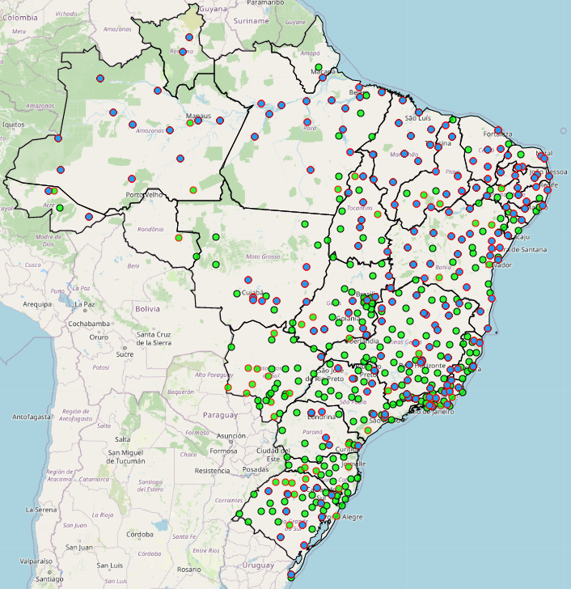

# INMET.jl

[![][build-img]][build-url] [![][codecov-img]][codecov-url]

Julia API to access data from the [Instituto Nacional de Metereologia (INMET)](https://portal.inmet.gov.br).

For more information about the data, please check their [manual](https://portal.inmet.gov.br/manual/manual-de-uso-da-api-esta%C3%A7%C3%B5es) and [viewer](https://mapas.inmet.gov.br).



## Installation

Please install the package with Julia's package manager:

```julia
] add INMET
```

## Usage

Below are a few examples of usage. For more details, please read the docstrings.

```julia
julia> using INMET

julia> INMET.stations()
604×15 DataFrame
 Row │ TP_ESTACAO  CD_ESTACAO  SG_ESTADO  CD_SITUACAO  CD_DISTRITO  CD_OSCAR        DT_FIM_OPERACAO  CD_WSI                   SG_ENTIDADE  DT_INICIO_OPERACAO             DC_NOME    ⋯
     │ String      String      String     String       String       String?         Missing          String?                  String       String                         String     ⋯
─────┼────────────────────────────────────────────────────────────────────────────────────────────────────────────────────────────────────────────────────────────────────────────────
   1 │ Automatica  A422        BA         Pane          04          0-2000-0-86765          missing  0-76-0-2906907000000408  INMET        2008-07-20T21:00:00.000-03:00  ABROLHOS   ⋯
   2 │ Automatica  A360        CE         Pane          03          0-2000-0-81755          missing  0-76-0-2300200000000446  INMET        2009-04-21T21:00:00.000-03:00  ACARAU
  ⋮  │     ⋮           ⋮           ⋮           ⋮            ⋮             ⋮                ⋮                    ⋮                  ⋮                     ⋮                         ⋮ ⋱
 603 │ Automatica  A247        PA         Operante      02          0-2000-0-81896          missing  0-76-0-1508407000000527  INMET        2016-09-10T21:00:00.000-03:00  XINGUARA
 604 │ Automatica  A255        MA         Operante      02          0-2000-0-81747          missing  0-76-0-2114007000000596  INMET        2019-09-17T21:00:00.000-03:00  ZE DOCA
                                                                                                                                                        5 columns and 600 rows omitted

julia> INMET.series(:A301, Date(2021,1,1), Date(2021,7,31))
212×13 DataFrame
 Row │ CD_ESTACAO  UF      VEL_VENTO_MED  DC_NOME  DT_MEDICAO  VL_LONGITUDE  VL_LATITUDE  TEMP_MIN    TEMP_MED    TEMP_MAX    UMID_MIN    UMID_MED    CHUVA      
     │ String      String  String?        String   String      Quantity…     Quantity…    Quantity…?  Quantity…?  Quantity…?  Quantity…?  Quantity…?  Quantity…? 
─────┼───────────────────────────────────────────────────────────────────────────────────────────────────────────────────────────────────────────────────────────
   1 │ A301        PE      1.7            RECIFE   2021-01-01     -34.9592°    -8.05917°     24.3 °C     27.2 °C     31.0 °C      54.0 %      72.5 %      2.8 mm
   2 │ A301        PE      1.6            RECIFE   2021-01-02     -34.9592°    -8.05917°     22.3 °C     27.0 °C     31.6 °C      54.0 %      72.9 %      0.0 mm
  ⋮  │     ⋮         ⋮           ⋮           ⋮         ⋮            ⋮             ⋮           ⋮           ⋮           ⋮           ⋮           ⋮           ⋮
 211 │ A301        PE      1.1            RECIFE   2021-07-30     -34.9592°    -8.05917°     19.9 °C     23.8 °C     28.7 °C      61.0 %      86.0 %      0.0 mm
 212 │ A301        PE      missing        RECIFE   2021-07-31     -34.9592°    -8.05917°     missing     missing     missing     missing     missing      6.6 mm
                                                                                                                                                 208 rows omitted

julia> INMET.on(Date(2021,7,1))
16056×24 DataFrame
   Row │ CD_ESTACAO  UF      HR_MEDICAO  DC_NOME           DT_MEDICAO  VL_LONGITUDE  VL_LATITUDE  TEM_INS     TEM_MIN     TEM_MAX     UMD_INS     UMD_MIN     UMD_MAX     PRE_INS    ⋯
       │ String      String  String      String            String      Quantity…     Quantity…    Quantity…?  Quantity…?  Quantity…?  Quantity…?  Quantity…?  Quantity…?  Quantity…? ⋯
───────┼──────────────────────────────────────────────────────────────────────────────────────────────────────────────────────────────────────────────────────────────────────────────
     1 │ A001        DF      0000        BRASILIA          2021-07-01     -47.9258°    -15.7894°     15.4 °C     15.0 °C     15.7 °C      61.0 %      61.0 %      63.0 %  890.9 mbar ⋯
     2 │ A001        DF      0100        BRASILIA          2021-07-01     -47.9258°    -15.7894°     14.7 °C     14.7 °C     15.6 °C      63.0 %      61.0 %      63.0 %  891.2 mbar
   ⋮   │     ⋮         ⋮         ⋮              ⋮              ⋮            ⋮             ⋮           ⋮           ⋮           ⋮           ⋮           ⋮           ⋮           ⋮      ⋱
 16055 │ S837        PR      2200        UNIÃO DA VITÓRIA  2021-07-01     -51.0671°    -26.2336°     10.2 °C      8.9 °C     11.9 °C      85.0 %     missing     missing     missing
 16056 │ S837        PR      2300        UNIÃO DA VITÓRIA  2021-07-01     -51.0671°    -26.2336°      7.9 °C      7.2 °C      9.0 °C      96.0 %     missing     missing     missing
                                                                                                                                                     10 columns and 16052 rows omitted
```

[build-img]: https://img.shields.io/github/workflow/status/JuliaClimate/INMET.jl/CI?style=flat-square
[build-url]: https://github.com/JuliaClimate/INMET.jl/actions

[codecov-img]: https://img.shields.io/codecov/c/github/JuliaClimate/INMET.jl?style=flat-square
[codecov-url]: https://codecov.io/gh/JuliaClimate/INMET.jl
